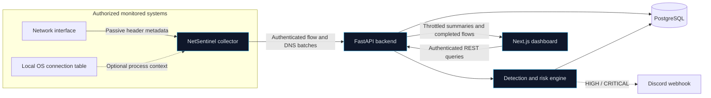

<p align="center"><strong>[Project logo placeholder]</strong></p>
<h1 align="center">NetSentinel</h1>
<p align="center"><strong>Passive network visibility and defensive security analytics</strong></p>
<p align="center">
  <a href="https://github.com/Thenightdark/NetSentinel/actions/workflows/ci.yml"></a>
</p>

NetSentinel is a self-hosted network observability and security analysis platform.
It passively converts packet-header metadata into directional flows, enriches
local traffic with host and optional process context, evaluates explainable
detection rules, and presents the results through a real-time web dashboard.

> **Authorization notice:** NetSentinel is intended only for monitoring systems
> and networks you own or have explicit permission to monitor. Do not use it to
> observe third-party traffic without authorization.

NetSentinel does not retain packet payloads and does not implement packet
injection, credential interception, man-in-the-middle behavior, exploitation,
or automated offensive actions.

## Contents

- [Screenshots](#screenshots)
- [Features](#features)
- [Architecture](#architecture)
- [Technology stack](#technology-stack)
- [How NetSentinel works](#how-netsentinel-works)
- [Installation](#installation)
- [Docker quick start](#docker-quick-start)
- [Collector setup](#collector-setup)
- [Dashboard setup](#dashboard-setup)
- [Security detections](#security-detections)
- [Supported operating systems](#supported-operating-systems)
- [API documentation](#api-documentation)
- [Example alert](#example-alert)
- [Project structure](#project-structure)
- [Testing](#testing)
- [Roadmap](#roadmap)
- [Limitations](#limitations)
- [Security and privacy](#security-and-privacy)
- [Contributing](#contributing)
- [License](#license)

## Screenshots

Screenshots will be added as the interface stabilizes.

| Overview dashboard | Security events |
| --- | --- |
| _Placeholder: live throughput, hosts, protocols, and recent activity_ | _Placeholder: defensive alert timeline and evidence panel_ |

| Host details | Aggregated network map |
| --- | --- |
| _Placeholder: host risk, traffic history, destinations, and alerts_ | _Placeholder: observed LAN hosts and grouped external destinations_ |

## Features

- Passive IPv4 and IPv6 packet-header metadata collection
- Directional five-tuple flow aggregation with bounded in-memory state
- Authenticated, batched collector ingestion with retries and idempotency
- Multiple collector agents with independent identities and API keys
- Passive LAN host discovery without active probing or scanning
- Optional local PID and process-name correlation through `psutil`
- Passive DNS query metadata and response-status monitoring
- Configurable defensive detection rules and explainable risk scores
- Alert states: `NEW`, `ACKNOWLEDGED`, and `RESOLVED`
- Real-time dashboard updates over a throttled WebSocket stream
- Historical statistics using time buckets instead of repeated raw-row scans
- Interactive host pages, security-event timeline, and aggregated network map
- Optional rate-limited Discord notifications for high-severity alerts
- Dashboard user authentication with Argon2 password hashes and HTTP-only sessions
- PostgreSQL persistence managed through Alembic migrations
- Deterministic tests based entirely on synthetic network metadata

## Architecture



The collector is deliberately separated from the backend. Packet capture stays
on the monitored machine, while only normalized metadata and completed flow
aggregates cross the ingestion boundary. The dashboard never receives individual
packets.

## Technology stack

| Area | Technology |
| --- | --- |
| Collector | Python, Scapy, psutil, httpx |
| Backend | Python, FastAPI, Pydantic, SQLAlchemy |
| Database | PostgreSQL, Alembic migrations |
| Real-time updates | FastAPI WebSockets |
| Dashboard | Next.js, React, TypeScript, Tailwind CSS |
| Visualization | Recharts, React Flow |
| Authentication | Argon2 password hashing, signed revocable sessions, collector API keys |
| Testing and quality | pytest, Ruff, ESLint, TypeScript |
| Deployment | Docker, Docker Compose, GitHub Actions CI |

## How NetSentinel works

1. **Observe:** the collector passively reads packet metadata from a selected
   local interface. It extracts addresses, ports, protocol, packet size, TCP
   flags, interface, and narrowly scoped DNS metadata where available.
2. **Normalize:** malformed or unsupported packets are ignored safely. Packet
   payloads are excluded from NetSentinel's stored models.
3. **Aggregate:** packets are grouped into directional flows by source address,
   source port, destination address, destination port, and protocol. Inactive
   flows are finalized after a configurable timeout.
4. **Deliver:** completed flows and DNS observations enter bounded background
   queues and are sent in authenticated batches. Temporary backend failures do
   not stop packet capture.
5. **Persist and enrich:** the API validates each batch, deduplicates retries,
   stores flow metadata, updates local-host records, and maintains historical
   time buckets.
6. **Analyze:** configurable rules produce cautious security signals with
   structured evidence, an auditable risk score, and a severity classification.
7. **Present:** authenticated dashboard clients query historical data and receive
   compact live summaries over WebSockets.

## Installation

### Prerequisites

- Git
- Python 3.12 or newer recommended
- PostgreSQL 17 or a compatible supported PostgreSQL release
- Node.js 22 or newer and pnpm 11 for local dashboard development
- Docker Engine or Docker Desktop with Compose for the recommended quick start
- Npcap on Windows when using live packet capture

Clone the repository:

```bash
git clone https://github.com/Thenightdark/NetSentinel.git
cd NetSentinel
```

Create a local configuration file:

```bash
cp .env.example .env
```

On Windows PowerShell:

```powershell
Copy-Item .env.example .env
```

Before starting NetSentinel, replace every development password and secret in
`.env`. Generate independent secrets rather than reusing one value:

```bash
python -c "import secrets; print(secrets.token_urlsafe(48))"
```

At minimum, change:

- `POSTGRES_PASSWORD`
- `NETSENTINEL_AGENT_ENROLLMENT_KEY`
- `NETSENTINEL_AUTH_SECRET`
- `NETSENTINEL_ADMIN_PASSWORD`

Never commit the populated `.env` file.

## Docker quick start

Docker Compose is the recommended way to start PostgreSQL, the API, and the
dashboard together:

```bash
docker compose up --build -d
docker compose ps
```

After the health checks pass:

- Dashboard: <http://localhost:3000>
- API: <http://localhost:8000>
- Swagger UI: <http://localhost:8000/docs>

Sign in with the administrator username and password configured in `.env`.
Database migrations run automatically when the backend container starts, and
PostgreSQL data is retained in the `postgres-data` volume.

View logs or stop the stack with:

```bash
docker compose logs -f backend dashboard
docker compose down
```

The collector is intentionally not included in Compose because it needs access
to a real interface on the machine being monitored. Run it separately on each
authorized host using the [collector setup](#collector-setup) below.

### Manual backend setup

For backend development without containers, start a PostgreSQL instance matching
`DATABASE_URL`, then run:

```bash
python -m venv .venv
source .venv/bin/activate
python -m pip install -r requirements-dev.txt
alembic upgrade head
uvicorn backend.main:app --reload --port 8000
```

Activate the environment on Windows with:

```powershell
.venv\Scripts\Activate.ps1
```

Application startup intentionally does not call SQLAlchemy `create_all`.
Schema changes remain explicit and reproducible through Alembic. See
[`docs/postgresql.md`](docs/postgresql.md) for migration guidance.

## Collector setup

Install the Python dependencies from the repository root and make the enrollment
secret available to the collector process. The enrollment secret is used only
for first registration; the backend then issues a unique agent key and the
collector saves it in `~/.netsentinel/agent.json`.

Linux or macOS shell:

```bash
export NETSENTINEL_BACKEND_URL=http://localhost:8000
export NETSENTINEL_AGENT_ENROLLMENT_KEY="your-enrollment-secret"
python -m collector.main --list-interfaces
python -m collector.main --interface eth0
```

Windows PowerShell:

```powershell
$env:NETSENTINEL_BACKEND_URL = "http://localhost:8000"
$env:NETSENTINEL_AGENT_ENROLLMENT_KEY = "your-enrollment-secret"
python -m collector.main --list-interfaces
python -m collector.main --interface "Ethernet"
```

Use an exact interface identifier returned by `--list-interfaces`. Press
`Ctrl+C` to finalize active flows and stop cleanly.

Useful collector options:

```bash
# Print readable packet metadata while developing
python -m collector.main --interface eth0 --debug

# Stop after a bounded number of packets
python -m collector.main --interface eth0 --count 25

# Change the flow inactivity timeout
python -m collector.main --interface eth0 --flow-timeout 30

# Run safely without opening a capture socket
python -m collector.main --demo

# Add best-effort local process context
python -m collector.main --interface eth0 --process-correlation
```

If packet-capture permissions are unavailable, the collector falls back to demo
mode by default. Use `--no-demo-fallback` when an unavailable live capture should
instead return an error.

### Windows capture permissions

Install [Npcap](https://npcap.com/) and use an elevated PowerShell session when
required by the local Npcap configuration. Interface names vary, so do not
assume the interface is named `Ethernet`.

### Linux capture permissions

Live capture usually requires root or network-capture capabilities. Prefer
granting narrowly scoped capabilities to a dedicated virtual-environment Python
interpreter instead of running the entire collector as root:

```bash
sudo setcap cap_net_raw,cap_net_admin=eip "$(readlink -f "$(which python)")"
python -m collector.main --interface eth0
sudo setcap -r "$(readlink -f "$(which python)")"
```

Any script executed by a capability-enabled interpreter receives those
capabilities, so use a dedicated environment and remove them when finished.

## Dashboard setup

For local dashboard development:

```bash
cd dashboard
corepack enable
pnpm install --frozen-lockfile
pnpm dev
```

The local defaults expect the API at `http://localhost:8000` and the live stream
at `ws://localhost:8000/ws/live`. Override these values when needed:

```dotenv
NEXT_PUBLIC_API_URL=http://localhost:8000
NEXT_PUBLIC_WS_URL=ws://localhost:8000/ws/live
INTERNAL_API_URL=http://localhost:8000
```

Open <http://localhost:3000>. Dashboard routes include:

| Route | Purpose |
| --- | --- |
| `/` | Live overview and recent activity |
| `/traffic` | Filterable completed network flows |
| `/hosts` | Observed hosts and active-state filtering |
| `/hosts/[id]` | Host traffic, risk, destinations, flows, and alerts |
| `/alerts` | Alert queue and status management |
| `/events` | Chronological security-event investigation timeline |
| `/agents` | Registered collector inventory and online state |
| `/map` | Aggregated LAN and external-destination topology |
| `/settings` | Persistent detection thresholds and sensitivity guidance |

## Security detections

NetSentinel evaluates flow and DNS metadata as defensive signals. A detection is
not proof that an attack occurred; expected administration, discovery, software
updates, backups, or unusual workloads can produce similar patterns.

| Detection | Signal evaluated |
| --- | --- |
| Possible port scan | One source contacts many distinct destination ports in a short window |
| Connection spike | A host exceeds both its configured minimum and its recent baseline |
| Unusual destination port | A flow targets a configured uncommon or higher-risk port |
| Bandwidth spike | Inbound or outbound flow volume crosses a configured threshold |
| New host | A previously unseen local-network address appears in observed traffic |
| High DNS query rate | One client produces an unusually large number of DNS queries |
| Unusually long domain | A queried domain exceeds a configurable length |
| Repeated failed DNS lookups | One client repeatedly receives failed DNS response statuses |

Core port-scan, bandwidth, and connection thresholds are stored in PostgreSQL
and managed from `/settings`. Advanced thresholds and alert cooldowns are
configured through environment variables documented in `.env.example`.

Each alert receives a bounded score from 0 to 100 using documented factors such
as the rule type, threshold ratio, correlated detections, traffic direction, and
previous alert history. The score maps to `INFO`, `LOW`, `MEDIUM`, `HIGH`, or
`CRITICAL`. See [`docs/risk-scoring.md`](docs/risk-scoring.md) for the complete
methodology.

## Supported operating systems

| Component | Support status |
| --- | --- |
| Collector on Windows | Supported with Npcap; elevated access may be required |
| Collector on Linux | Supported with root or appropriate capture capabilities |
| Collector on macOS | Expected to work through Scapy, but not currently validated or documented as a supported target |
| Backend and dashboard | Recommended through Docker on Linux, Windows, or macOS hosts |

Permissions, interface naming, process correlation, and packet visibility vary
by operating system and capture-driver configuration.

## API documentation

FastAPI generates interactive documentation automatically:

- Swagger UI: <http://localhost:8000/docs>
- ReDoc: <http://localhost:8000/redoc>
- OpenAPI schema: <http://localhost:8000/openapi.json>

Primary interfaces:

| Method and path | Authentication | Description |
| --- | --- | --- |
| `GET /api/health` | Public | API and database health |
| `POST /api/auth/login` | Public | Start a dashboard session |
| `POST /api/auth/logout` | Dashboard session | Revoke the current session |
| `GET /api/auth/me` | Dashboard session | Current dashboard user |
| `POST /api/agents/register` | Enrollment key | Register a new collector identity |
| `POST /api/agents/heartbeat` | Collector key | Update collector presence |
| `POST /api/ingest/flows` | Collector key | Submit a finalized flow batch |
| `POST /api/ingest/dns` | Collector key | Submit normalized DNS metadata |
| `GET /api/flows` | Dashboard session | Filtered and paginated flows |
| `GET /api/hosts` | Dashboard session | Observed hosts |
| `GET /api/alerts` | Dashboard session | Filtered security alerts |
| `PATCH /api/alerts/{id}/status` | Dashboard session | Update alert workflow state |
| `GET /api/stats/history` | Dashboard session | Historical rollups for `5m`, `1h`, `24h`, or `7d` |
| `GET /api/dns/top-domains` | Dashboard session | Aggregated DNS domain activity |
| `GET /api/map` | Dashboard session | Bounded aggregated topology |
| `GET`, `PUT /api/settings/detection` | Dashboard session | Read or replace rule thresholds |
| `WS /ws/live` | Dashboard session | Live summaries and completed flows |

Collector API-key authentication is intentionally separate from dashboard user
authentication. Query parameters, pagination rules, validation schemas, and
response examples are available in Swagger UI.

## Example alert

```json
{
  "id": 42,
  "timestamp": "2026-09-22T14:05:18Z",
  "severity": "HIGH",
  "risk_score": 68,
  "alert_type": "possible_port_scan",
  "source_ip": "192.168.1.25",
  "destination_ip": "192.168.1.10",
  "description": "Possible port scan: 192.168.1.25 contacted 31 distinct destination ports within 10 seconds. This may be legitimate discovery traffic and should be reviewed in context.",
  "evidence": {
    "window_seconds": 10,
    "unique_destination_ports": 31,
    "port_threshold": 25,
    "destination_count": 1,
    "sample_ports": [22, 53, 80, 135, 139, 443, 445, 3389],
    "risk_score_breakdown": {
      "methodology_version": "1.1",
      "rule_base": 35,
      "rule_correlation": 12,
      "connection_frequency": 4,
      "unique_ports": 9,
      "bandwidth_volume": 0,
      "dns_query_rate": 0,
      "domain_length": 0,
      "dns_lookup_failures": 0,
      "traffic_direction": 0,
      "previous_alert_history": 8,
      "distinct_rules_for_source": 3,
      "previous_alert_count": 4,
      "total": 68
    }
  },
  "status": "NEW"
}
```

Descriptions intentionally use analytical language such as “possible” and
“unusual traffic pattern.” NetSentinel does not automatically declare that an
attack occurred.

## Project structure

```text
netsentinel/
├── .github/workflows/     # Continuous-integration checks
├── backend/
│   ├── api/               # REST route definitions and dependencies
│   ├── database/          # SQLAlchemy session and metadata
│   ├── migrations/        # Alembic schema history
│   ├── models/            # Persistent database entities
│   ├── schemas/           # Pydantic request and response contracts
│   ├── services/          # Ingestion, detection, statistics, and notifications
│   └── websocket/         # Live connection management
├── collector/             # Passive capture, aggregation, correlation, delivery
├── dashboard/             # Next.js application
├── docs/                  # Architecture and operational documentation
├── tests/                 # Synthetic unit, API, database, and resilience tests
├── alembic.ini
├── docker-compose.yml
├── pyproject.toml         # Python lint configuration
├── pytest.ini
└── requirements-dev.txt
```

## Testing

Install the development dependencies and run the complete Python suite:

```bash
python -m pip install -r requirements-dev.txt
pytest
ruff check backend collector tests
```

The tests use synthetic packets and flows, in-memory databases, and mock HTTP
transports. They do not capture live traffic, contact external systems, require
packet-capture privileges, or generate malicious traffic.

Run the dashboard checks from `dashboard/`:

```bash
pnpm install --frozen-lockfile
pnpm lint
pnpm typecheck
pnpm build
```

The GitHub Actions workflow runs these checks for pushes and pull requests. It
does not deploy or publish NetSentinel.

## Roadmap

- Configurable retention and data-pruning policies
- User-management interface and role-based access control
- Collector key rotation, revocation, and administrative lifecycle controls
- Additional notification providers through the existing provider interface
- Export formats and integrations for external observability platforms
- Broader operating-system validation and packaged collector installers
- Production deployment guidance for TLS, reverse proxies, backup, and scaling
- Expanded performance and long-running ingestion tests

Roadmap items describe intended directions, not committed release dates.

## Limitations

- NetSentinel analyzes metadata and heuristics; it is not an IDS signature feed,
  antivirus product, packet-forensics platform, or proof that activity is malicious.
- Encrypted application payloads remain opaque, and packet payloads are not stored.
- A collector sees only traffic visible to its selected interface and operating
  system. Switched-network traffic from other devices may not be observable.
- Flow records are directional approximations rather than reconstructed sessions.
- DNS monitoring covers DNS packets visible to the collector; encrypted DNS may
  not expose query metadata.
- Hostname and process correlation are best-effort and permission-dependent.
- Bounded delivery queues protect capture continuity but can drop metadata during
  a prolonged outage when the configured queue is full.
- Rule thresholds require tuning for each environment and can produce false positives.
- The included Compose configuration is suitable for development and evaluation,
  not a hardened internet-facing deployment.
- High availability, horizontal scaling, long-term archival, and automatic
  remediation are not currently provided.

## Security and privacy

- **Monitor only systems and networks you own or are authorized to monitor.**
- Run packet capture with the least privilege available on the operating system.
- Keep `.env`, collector identity files, session secrets, API keys, passwords,
  and webhook URLs out of version control.
- Replace all development credentials before sharing or deploying an instance.
- Use HTTPS and secure WebSockets behind a trusted reverse proxy outside local
  development, and enable secure authentication cookies.
- Restrict the backend, PostgreSQL, and dashboard to trusted networks and apply
  normal host firewall controls.
- Treat IP addresses, hostnames, domain queries, process names, and connection
  timing as potentially sensitive operational data even though payloads are absent.
- Review retention needs and applicable privacy or employment requirements before
  monitoring shared or workplace systems.
- Discord notifications disclose selected alert metadata to the configured
  webhook provider; enable them only when that disclosure is acceptable.

See [`docs/safety.md`](docs/safety.md) for the project’s defensive boundaries and
[`docs/authentication.md`](docs/authentication.md) for the authentication model.
Security-sensitive problems should not include real credentials, private packet
captures, or confidential telemetry in a public issue.

## Contributing

Contributions that preserve NetSentinel’s defensive, passive scope are welcome.

1. Fork the repository and create a focused feature branch.
2. Install `requirements-dev.txt` and the dashboard dependencies.
3. Keep collection metadata-only; do not add payload harvesting, packet injection,
   credential interception, exploitation, evasion, or MITM functionality.
4. Add or update deterministic tests for behavioral changes.
5. Run the Python and dashboard checks documented in [Testing](#testing).
6. Update relevant documentation and `.env.example` entries.
7. Open a pull request explaining the change, security implications, and test results.

Keep pull requests small where practical and never commit secrets, local databases,
packet captures, generated build output, or collector identity files.

## License

This repository does not currently contain a `LICENSE` file. Until a license is
added, the source is publicly visible but no open-source reuse, modification, or
redistribution rights are granted by default. Project maintainers should select
and add an explicit license before presenting NetSentinel as a licensed
open-source distribution.
